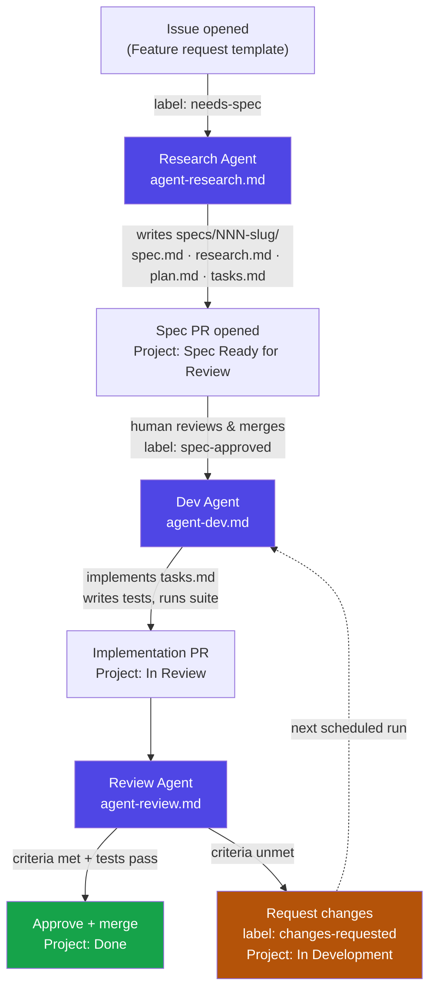
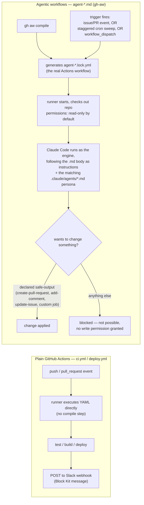

# Spec-Driven, Agent-Run SDLC Template

A GitHub template repository for running a spec → build → review software
lifecycle where AI agents (Claude Code) do the research/spec drafting,
implementation, and code review, coordinated entirely through GitHub Issues,
GitHub Projects (v2), and GitHub Actions.

> Generated from `spec-driven-sdlc-template`. See
> [docs/ARCHITECTURE.md](docs/ARCHITECTURE.md) for the full design rationale.

## What this gives you

| Piece | Where |
|---|---|
| Spec folder structure (spec → research → plan → tasks → contracts) | [`.specify/templates/`](.specify/templates/), populated per-feature under `specs/` |
| Research / Dev / Review agent personas | [`.claude/agents/`](.claude/agents/) |
| Agentic workflows (scheduled + event-triggered) | [`.github/workflows/agent-*.md`](.github/workflows/) (GitHub Agentic Workflows / `gh-aw`) |
| CI + deploy → Slack | [`.github/workflows/ci.yml`](.github/workflows/ci.yml), [`deploy.yml`](.github/workflows/deploy.yml) |
| Project board state machine | [`docs/PROJECT_SETUP.md`](docs/PROJECT_SETUP.md) |
| Full pipeline docs | [`docs/AGENTS.md`](docs/AGENTS.md), [`docs/WORKFLOWS.md`](docs/WORKFLOWS.md) |

## Quickstart

1. Click **Use this template** on GitHub (or `gh repo create my-project --template <org>/spec-driven-sdlc-template`).
2. Follow [docs/SETUP.md](docs/SETUP.md) end to end — it walks through installing
   `gh-aw`, wiring the `ANTHROPIC_API_KEY`/`CLAUDE_CODE_OAUTH_TOKEN` and
   `SLACK_WEBHOOK_URL` secrets, and creating the GitHub Project.
3. Open an issue describing a feature, label it `needs-spec`, and watch the
   Research Agent draft `specs/001-your-feature/`.
4. Approve the spec (label `spec-approved`) to let the Dev Agent implement it.
5. The Review Agent reviews every PR the Dev Agent opens against the spec's
   acceptance criteria.

## Pipeline at a glance

See [docs/AGENTS.md](docs/AGENTS.md) for the full state machine and labels.

## How the workflows actually run

Two different mechanisms are at play, and they're easy to conflate:

**The safety boundary is the point.** An agentic workflow's top-level
`permissions:` block is read-only — Claude can read the whole repo and
reason freely, but it cannot push a commit, merge a PR, or touch anything
outside what's declared under `safe-outputs:` in that workflow's frontmatter.
If `.claude/agents/dev-agent.md` decided to rewrite `docs/ARCHITECTURE.md` on
a whim, it couldn't — `agent-dev.md`'s safe-outputs only allow
`create-pull-request`, `add-comment`, and `update-issue`, and even the PR it
opens is a normal PR someone still has to merge (or the Review Agent
approves per its own, separately-scoped safe-outputs).

Each agent workflow is wired with three trigger types so nothing silently
stalls:

| Trigger | Example | Why |
|---|---|---|
| Real event | issue labeled `needs-spec` | Fires immediately — the common case |
| Scheduled sweep | `cron: "0 13 * * 1-5"`, capped to 2 issues/run | Fallback if an event trigger is ever missed, and bounds token spend since the whole pipeline shares one 5-hour rate-limit window |
| `workflow_dispatch` | manual "Run workflow" button | For testing and one-off manual runs |

See [docs/WORKFLOWS.md](docs/WORKFLOWS.md) for the full trigger table, the
required secrets, and why `agent-review.md` needs a `custom` safe-output job
instead of a built-in one.

## Status

This template implements the local scaffolding (agent personas, workflow
definitions, spec-kit-style templates, docs). It does **not** ship live
credentials or a configured Slack channel — see [docs/SETUP.md](docs/SETUP.md)
for the one-time setup every new project generated from this template needs.
