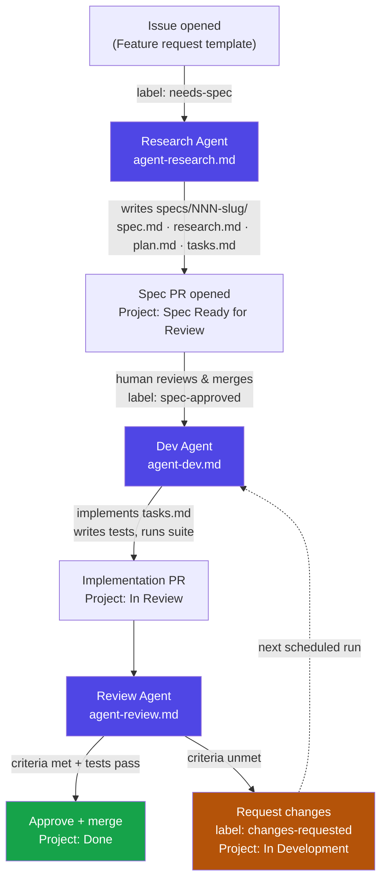
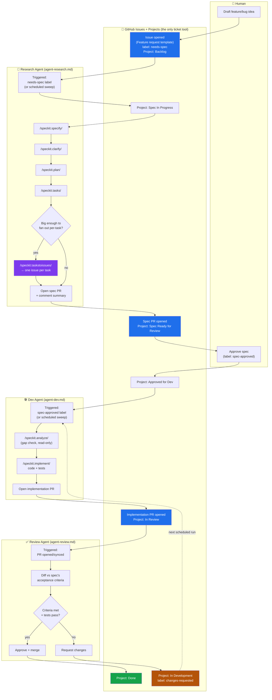
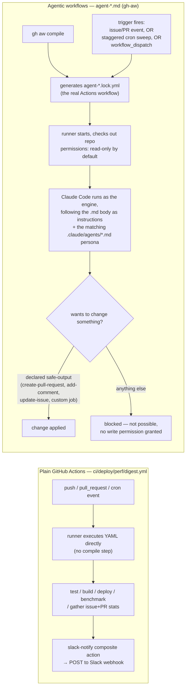

# Spec-Driven, Agent-Run SDLC Template

A GitHub template repository for running a spec → build → review software
lifecycle where AI agents (Claude Code) do the research/spec drafting,
implementation, and code review, coordinated entirely through GitHub Issues,
GitHub Projects (v2), and GitHub Actions.

> Generated from `spec-driven-sdlc-template`. See
> [docs/ARCHITECTURE.md](docs/ARCHITECTURE.md) for the full design rationale.

## What this gives you

| Piece | Where |
|---|---|
| Spec-driven workflow (specify → clarify → plan → tasks → implement) | Real [Spec Kit](https://github.com/github/spec-kit) `/speckit.*` commands, installed via `specify init --here` — see [docs/SETUP.md](docs/SETUP.md) |
| Ticket/PM tool | **GitHub Issues + Projects (v2)** — no separate tool; see [docs/AGENTS.md#raising-issues](docs/AGENTS.md#raising-issues) |
| Research / Dev / Review agent personas | [`.claude/agents/`](.claude/agents/) |
| Agentic workflows (scheduled + event-triggered) | [`.github/workflows/agent-*.md`](.github/workflows/) (GitHub Agentic Workflows / `gh-aw`) |
| General-purpose PR code review (complements the Review Agent) | [CodeRabbit](https://coderabbit.ai) via [`.coderabbit.yaml`](.coderabbit.yaml) — see [docs/CODE_REVIEW.md](docs/CODE_REVIEW.md) |
| CI, deploy, perf, digest, and agent milestones → Slack | [`ci.yml`](.github/workflows/ci.yml), [`deploy.yml`](.github/workflows/deploy.yml), [`perf.yml`](.github/workflows/perf.yml), [`project-digest.yml`](.github/workflows/project-digest.yml), [`agent-notify.yml`](.github/workflows/agent-notify.yml), via one shared [`slack-notify` action](.github/actions/slack-notify/action.yml) |
| Project board state machine | [`docs/PROJECT_SETUP.md`](docs/PROJECT_SETUP.md) |
| Full pipeline docs | [`docs/AGENTS.md`](docs/AGENTS.md), [`docs/WORKFLOWS.md`](docs/WORKFLOWS.md), [`docs/CODE_REVIEW.md`](docs/CODE_REVIEW.md) |
| Getting started | [`docs/SETUP.md`](docs/SETUP.md) — tool-by-tool checklist with expected results at each step |
| Every key/secret this repo uses | [`.env.example`](.env.example) — one file listing what each is for and where it's actually consumed |

## Quickstart

1. Click **Use this template** on GitHub (or `gh repo create my-project --template <org>/spec-driven-sdlc-template`).
2. Follow [docs/SETUP.md](docs/SETUP.md) end to end — it walks through
   installing `gh-aw`, installing **Spec Kit** (`specify init --here`) and
   setting your project's constitution, wiring the
   `ANTHROPIC_API_KEY`/`CLAUDE_CODE_OAUTH_TOKEN` and `SLACK_WEBHOOK_URL`
   secrets, and creating the GitHub Project.
3. **Raise a feature** — open a GitHub Issue with the **Feature request**
   template, label it `needs-spec`. That label is the only trigger; there's
   no separate ticket tool. The Research Agent picks it up and runs
   `/speckit.specify` → `/speckit.clarify` → `/speckit.plan` →
   `/speckit.tasks` to draft `specs/001-your-feature/`.
4. Approve the spec (label `spec-approved`) to let the Dev Agent run
   `/speckit.analyze` → `/speckit.implement`.
5. The Review Agent reviews every PR the Dev Agent opens against the spec's
   acceptance criteria.

See [The full picture: issue to merge](#the-full-picture-issue-to-merge)
below for exactly who does what, in order.

## Pipeline at a glance

See [docs/AGENTS.md](docs/AGENTS.md) for the full state machine and labels.

## The full picture: issue to merge

The diagram above compresses "Research Agent" and "Dev Agent" into single
boxes. Here's what's actually happening inside each of those, and — since
this is the question that usually trips people up — **how a feature or bug
actually gets raised as a ticket in the first place**. There are two answers:
a human writes the initial ask as a plain GitHub Issue (lane 2 below), and,
once that issue has a spec with a task list, Spec Kit's own
`/speckit.taskstoissues` command can fan `tasks.md` out into individual
per-task GitHub issues (lane 3) — use that second path when a feature is big
enough that its tasks deserve independent tracking; skip it for anything
small enough to ship as one PR.

Read it lane by lane:

- **Human** — only two required actions: write the original ask, and
  approve the resulting spec. Everything else is optional oversight.
- **GitHub Issues + Projects** — the entire "ticket system." An issue's
  labels and its linked Project item are the complete state; there's nothing
  else to keep in sync.
- **Research Agent** — turns a raw issue into a spec by literally running
  Spec Kit's own commands in sequence, not by improvising a file layout.
  `/speckit.taskstoissues` is the one optional branch: it's Spec Kit's
  built-in mechanism for turning `tasks.md` into individual GitHub issues
  when a feature is too big for one PR.
- **Dev Agent** — `/speckit.analyze` first (a read-only sanity check against
  the spec and the constitution), then `/speckit.implement` does the actual
  build. If analyze finds a real contradiction, the agent stops and comments
  rather than pushing through it.
- **Review Agent** — the one piece with no Spec Kit command backing it; it's
  a plain diff-vs-acceptance-criteria review, this template's own addition.

## How the workflows actually run

Two different mechanisms are at play, and they're easy to conflate:

**The safety boundary is the point.** An agentic workflow's top-level
`permissions:` block is read-only — Claude can read the whole repo and
reason freely, but it cannot push a commit, merge a PR, or touch anything
outside what's declared under `safe-outputs:` in that workflow's frontmatter.
If `.claude/agents/dev-agent.md` decided to rewrite `docs/ARCHITECTURE.md` on
a whim, it couldn't — `agent-dev.md`'s safe-outputs only allow
`create-pull-request`, `add-comment`, and `update-issue`, and even the PR it
opens is a normal PR someone still has to merge (or the Review Agent
approves per its own, separately-scoped safe-outputs).

Each agent workflow is wired with three trigger types so nothing silently
stalls:

| Trigger | Example | Why |
|---|---|---|
| Real event | issue labeled `needs-spec` | Fires immediately — the common case |
| Scheduled sweep | `cron: "0 13 * * 1-5"`, capped to 2 issues/run | Fallback if an event trigger is ever missed, and bounds token spend since the whole pipeline shares one 5-hour rate-limit window |
| `workflow_dispatch` | manual "Run workflow" button | For testing and one-off manual runs |

See [docs/WORKFLOWS.md](docs/WORKFLOWS.md) for the full trigger table, the
required secrets, and why `agent-review.md` needs a `custom` safe-output job
instead of a built-in one.

## Slack notifications

One Slack channel, fed by five sources, all going through the same reusable
[`.github/actions/slack-notify`](.github/actions/slack-notify/action.yml)
composite action so every message looks and behaves consistently — and all
five are **plain, deterministic GitHub Actions workflows**, none of them
dependent on an agent choosing to emit anything:

| Source | Fires on | Carries |
|---|---|---|
| **CI** (`ci.yml`) | Every push/PR | Pass/fail, test counts, coverage %, duration |
| **Deploy** (`deploy.yml`) | Push to `main` | Environment, commit, deployed URL |
| **Performance** (`perf.yml`) | Weekly cron / app-code push / manual | p50/p95 latency, throughput, bundle size |
| **Project digest** (`project-digest.yml`) | Weekdays, after the agent sweeps | Issues awaiting spec/review/dev, open PRs, PRs merged in 24h |
| **Agent milestones** (`agent-notify.yml`) | A PR labeled `spec`/`agent-generated` opens; a review is submitted on one | Spec/PR link, author, reviewer, review verdict |

`agent-notify.yml` is deliberately a separate, plain workflow — not part of
`agent-research.md`/`agent-dev.md`/`agent-review.md`. An earlier version of
this template had those three gh-aw workflows emit the Slack message
themselves via a custom safe-output, but that meant the notification (and
its accuracy) depended on the agent's own run reaching that instruction and
self-reporting correctly. Instead, `agent-notify.yml` triggers on the real
`pull_request`/`pull_request_review` GitHub events and reads the actual
event payload (PR title, review state) — it fires the same way whether an
agent or a human did the work, and can't silently no-op just because a run
timed out. See
[docs/WORKFLOWS.md#why-agent-milestones-arent-emitted-by-the-agent](docs/WORKFLOWS.md#why-agent-milestones-arent-emitted-by-the-agent)
for the full reasoning.

Every caller checks `secrets.SLACK_WEBHOOK_URL != ''` first — skip setting
the secret and every notification silently no-ops instead of failing the
workflow. See [`.env.example`](.env.example) for every key/secret this repo
uses in one place.

There's a sixth Slack source that deliberately bypasses all of the above:
[CodeRabbit](https://coderabbit.ai) (see
[docs/CODE_REVIEW.md](docs/CODE_REVIEW.md)) posts its own PR review
summaries to Slack once you connect it in *its own* dashboard — it doesn't
call `slack-notify` or use `SLACK_WEBHOOK_URL`, since that's a separate,
natively-supported integration on CodeRabbit's side.

## Status

This template implements the local scaffolding (agent personas, workflow
definitions, spec-kit-style templates, docs). It does **not** ship live
credentials or a configured Slack channel — see [docs/SETUP.md](docs/SETUP.md)
for the one-time setup every new project generated from this template needs.
